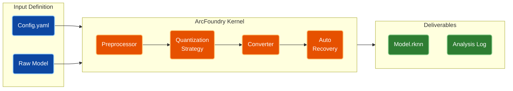

<div align="center">
  <h1>ArcFoundry Intelligent Model Conversion Pipeline</h1>
  <p><i>A Standardized, Engineering-Grade Model Deployment Framework based on Rockchip RKNN-Toolkit2</i></p>
</div>

<p align="center">
  
</p>

<p align="center">
  <a href="https://github.com/potterwhite/ArcFoundry/releases"></a>
  <a href="#"></a>
  <a href="#"></a>
  <a href="#"></a>
</p>

<p align="center">
  <strong>English</strong> | <a href="./docs/README_ZH_CN.md">简体中文</a>
</p>

---

### 📖 Introduction

**ArcFoundry** is an engineering-grade model conversion SDK designed specifically for Rockchip NPUs. It aims to resolve the fragmentation and uncertainty often encountered during the **ONNX to RKNN** conversion process, providing a unified build standard for all SoCs supported by `rknn-toolkit2`.

By utilizing a "Two-Stage Bootstrapping" architecture, this project completely decouples complex Python environment dependencies (Stage 1) from the core business logic (Stage 2). Whether dealing with conventional static graph models or complex streaming audio models (such as Sherpa/Zipformer), ArcFoundry delivers reproducible, high-precision quantization services via a unified **YAML declarative configuration**.

### 🏗️ System Architecture

We have moved away from the traditional, ad-hoc "one script per model" approach to build a standardized conversion pipeline.

**Core Pipeline Logic:**



---

### 🚀 Quick Start

This project uses a unique **Arc Bootloader** mechanism. **A single script handles both environment setup and execution.**

#### 1. Interactive Bootstrap

On the first run, `arc` automatically detects and builds an isolated Python virtual environment, installing the `rknn-toolkit2` version appropriate for your system.

```bash
# Launch directly
./arc
```

#### 2. Perform Conversion

ArcFoundry supports three operation modes. The **Shortcut Mode** is recommended:

```bash
# [Mode A] Shortcut Mode
# Automatically finds configs/rv1126b_sherpa.yaml and starts conversion
./arc rv1126b_sherpa

# [Mode B] Interactive Mode (Recommended)
# Run without arguments to see a menu of all available configurations
./arc

# [Mode C] Explicit Path Mode
./arc configs/my_custom_model.yaml
```

---

### ⌨️ Command Reference

| Scenario | Command | Description |
| :--- | :--- | :--- |
| **Env Init** | `./arc init` | Force re-installation of the venv environment and dependencies. |
| **Interactive Menu** | `./arc` | Lists all files in `configs/` for interactive selection. |
| **Quick Run** | `./arc <name>` | Run a specific configuration (no need to type the .yaml extension). |
| **Clean** | `./arc clean` | Deletes `workspace` and `output` directories. |
| **Deep Clean** | `./arc distclean` | **Use with caution**: Deletes venv, model repository, and all generated files (Factory Reset). |

---

### ✨ Core Features

ArcFoundry resolves edge cases that the official Toolkit finds difficult to handle, with deep optimizations specifically for **Streaming Models**:

1.  **Streaming Calibration**
    *   For models with **Internal States** (like RNN-T / Zipformer), traditional random input leads to quantization collapse.
    *   Built-in `StreamingAudioStrategy`: Simulates streaming inference (Sliding Window) on the PC side to capture Tensor data with the correct context memory for calibration.
    *   *Implementation: `core/quantization/strategies/streaming.py`*

2.  **Auto-Hybrid Patching**
    *   Automatically runs Simulator verification after conversion.
    *   If accuracy is below standard (Score < 0.99), it parses the layer-wise error report and intelligently rolls back sensitive layers (e.g., Conv, Gemm) to FP16 and recompiles. No manual debugging required.
    *   *Implementation: `core/rknn_adapter.py`*

3.  **Metadata Injection**
    *   Automatically extracts ONNX Metadata (e.g., `vocab_size`) and writes it into the RKNN model via `custom_string`. This supports direct reading by inference libraries (like Sherpa-Onnx), enabling a "Single-File Loop" for configuration and model files.

---

### 📂 Output Directory

All deliverables after conversion are located in the `output_dir` specified in the configuration file:

```text
output/rv1126b_release/
├── encoder_int8.rknn          # [Final Artifact] Quantized model
├── encoder.processed.onnx     # [Intermediate] Fixed-shape and simplified ONNX
├── quantization_log/          # [Debug] Quantization process logs
│   ├── error_analysis.txt     # Layer-wise accuracy analysis report
│   └── quantization.cfg       # Automatically generated hybrid precision config
└── verified_score.json        # Automated verification similarity score
```

### 🧩 Platform Support

ArcFoundry is based on the `rknn-toolkit2` kernel and theoretically supports all Rockchip SoCs covered by the SDK.

#### Verified Platforms

| Chip Series | Status | Remarks |
| :--- | :--- | :--- |
| **RV1126B / RV1109B** | ✅ Verified | Initial validation platform (Sherpa-Zipformer) |
| **Other RK Series** | ⏳ Pending | Theoretically supported as long as rknn-toolkit2 supports them |

#### How to support a new platform?

Please **duplicate** an existing configuration file and modify the `target` field:

```bash
# 1. Copy config template
cp configs/rv1126b_sherpa.yaml configs/rk3588_custom.yaml

# 2. Modify platform definition
#    Change platform to rk3588, rk3566, etc. (Must match rknn-toolkit2 support list)
vim configs/rk3588_custom.yaml
```

```yaml
target:
  platform: "rk3588"
```