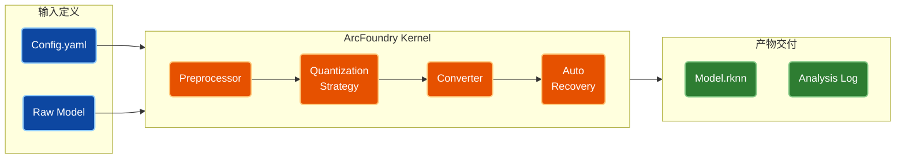

<div align="center">
  <h1>ArcFoundry 智能化模型转换流水线</h1>
  <p><i>基于 Rockchip RKNN-Toolkit2 的标准化、工程化模型部署框架</i></p>
</div>

<p align="center">
  
</p>

<p align="center">
  <a href="https://github.com/potterwhite/ArcFoundry/releases"></a>
  <a href="#"></a>
  <a href="#"></a>
  <a href="#"></a>
</p>

<p align="center">
  <a href="../README.md">English</a> | <strong>简体中文</strong>
</p>

---

### 📖 项目简介

**ArcFoundry** 是一个专为 Rockchip NPU 设计的工程化模型转换 SDK。它旨在解决 **ONNX 到 RKNN** 转换过程中的碎片化与不确定性问题，为所有支持 `rknn-toolkit2` 的 SoC 提供统一的构建标准。

通过“两阶段引导”架构，本项目将复杂的 Python 环境依赖（Stage 1）与核心业务逻辑（Stage 2）彻底解耦。无论是常规的静态图模型，还是复杂的流式音频模型（如 Sherpa/Zipformer），ArcFoundry 都能通过统一的 **YAML 声明式配置**，提供可复现、高精度的量化转换服务。

### 🏗️ 系统架构

我们摒弃了传统的“一模型一脚本”的作坊式开发，构建了一套标准化的转换流水线。

**核心流水线逻辑：**



---

### 🚀 快速上手

本项目采用独创的 **Arc Bootloader** 机制，**只需一个脚本，搞定环境与运行。**

#### 1. 交互式引导启动

首次使用时，`arc` 会自动检测并构建隔离的 Python 虚拟环境，并自动安装适配你系统的 `rknn-toolkit2`。

```bash
# 直接启动
./arc
```

#### 2. 执行转换

ArcFoundry 支持三种运行模式，推荐使用**快捷模式**：

```bash
# [模式 A] 快捷模式
# 自动寻找 configs/rv1126b_sherpa.yaml 并启动转换
./arc rv1126b_sherpa

# [模式 B] 交互模式 (推荐)
# 不带参数运行，将显示所有可用配置的菜单供选择
./arc

# [模式 C] 显式路径模式
./arc configs/my_custom_model.yaml
```

---

### ⌨️ 命令速查

| 场景 | 命令 | 作用 |
| :--- | :--- | :--- |
| **环境初始化** | `./arc init` | 强制重装 venv 环境及依赖 |
| **交互菜单** | `./arc` | 列出 `configs/` 下所有文件并交互式选择 |
| **快速运行** | `./arc <name>` | 运行指定配置 (无需写 .yaml 后缀) |
| **普通清理** | `./arc clean` | 删除 `workspace` 和 `output` 目录 |
| **深度清理** | `./arc distclean` | **慎用**：删除 venv、模型仓库等所有生成文件 (Factory Reset) |

---

### ✨ 核心特性

ArcFoundry 解决了官方 Toolkit 难以处理的边缘情况，尤其针对**流式模型（Streaming Models）**做了深度优化：

1.  **流式量化校准 (Streaming Calibration)**
    *   针对 RNN-T / Zipformer 等**带有内部状态（Internal States）**的模型，传统的随机输入会导致量化崩塌。
    *   内置 `StreamingAudioStrategy`：在 PC 端模拟流式推理（Sliding Window），捕捉带有正确上下文记忆的 Tensor 数据用于校准。
    *   *代码实现：`core/quantization/strategies/streaming.py`*

2.  **自动混合精度修补 (Auto-Hybrid Patching)**
    *   转换后自动运行 Simulator 验证。
    *   若精度未达标（Score < 0.99），自动解析层级误差报告，智能将敏感层（如 Conv, Gemm）回退至 FP16 并重编译，无需人工手动排查。
    *   *代码实现：`core/rknn_adapter.py`*

3.  **元数据注入 (Metadata Injection)**
    *   自动提取 ONNX Metadata（如 `vocab_size`），并通过 `custom_string` 写入 RKNN 模型，支持推理库（如 Sherpa-Onnx）直接读取，实现配置与模型文件的“单文件闭环”。

---

### 📂 产物目录

转换完成后的所有交付物均位于配置文件指定的 `output_dir` 中：

```text
output/rv1126b_release/
├── encoder_int8.rknn          # [最终产物] 量化后的模型
├── encoder.processed.onnx     # [中间态] 经过固定 Shape 和简化的 ONNX
├── quantization_log/          # [调试] 量化过程日志
│   ├── error_analysis.txt     # 逐层精度分析报告
│   └── quantization.cfg       # 自动生成的混合精度配置文件
└── verified_score.json        # 自动化验证的相似度评分
```

### 🧩 平台支持

ArcFoundry 基于 `rknn-toolkit2` 内核，理论上支持该 SDK 涵盖的所有 Rockchip SoC。

#### 已验证平台

| 芯片系列 | 验证状态 | 备注 |
| :--- | :--- | :--- |
| **RV1126B / RV1109B** | ✅ 已验证 | 本项目首发验证平台 (Sherpa-Zipformer) |
| **RK3588S** | ✅ 已验证 |  |
| **其他 RK 系列** | ⏳ 待验证 | 只要 rknn-toolkit2 支持，理论均可运行 |

#### 如何支持新平台？

请**复制**一份现有的配置文件，并修改其中的 `target` 字段：

```bash
# 1. 复制配置模板
cp configs/rv1126b_sherpa.yaml configs/rk3588_custom.yaml

# 2. 修改平台定义
#    将 platform 改为 rk3588, rk3566 等 (需匹配 rknn-toolkit2 支持列表)
vim configs/rk3588_custom.yaml
```

```yaml
target:
  platform: "rk3588"
```

---